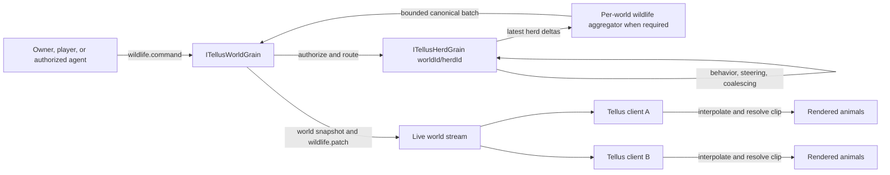

# Tellus Animal Autonomy and Herd Animation PRD

**Status:** Proposed

**Issue:** [DavinciDreams/tellus#110](https://github.com/DavinciDreams/tellus/issues/110)

**Product surfaces:** Tellus client, Hyades world service, Tellus MCP/agent tools

**Depends on:** [Tellus Animation System v1](./ANIMATION_SYSTEM_V1.md), embedded GLB animation metadata, authoritative world patches

**Primary milestone:** A synchronized deer herd that can graze, wander, flee, return home, and respond to an authorized “god of deer” controller

## 1. Executive summary

Tellus can already play embedded animations on placed animals and can choose idle, walk, run, fly,
or swim clips for pets and mounts. It does not yet give unowned wildlife an authoritative reason to
move, a safe destination, group coordination, or a durable behavior state.

This project adds a server-authoritative wildlife simulation with three layers:

1. **Animal presentation:** Tellus interpolates authoritative transforms and maps semantic intents
   such as `graze`, `walk`, and `run` onto embedded GLB clips.
2. **Herd autonomy:** one Hyades `ITellusHerdGrain` per world/herd decides group behavior,
   individual offsets, reactions, destinations, and simulation cadence.
3. **World and agent control:** authorized users or agents issue bounded commands to an animal,
   herd, species, region, or all wildlife in a world. The command expresses intent; Hyades validates
   and executes it.

The first release focuses on deer and reusable quadruped behavior. The architecture must also admit
ground, air, and water species without forcing all species into the same movement rules.

The defining product experience is:

> Deer graze near a forest edge. A player approaches and the closest animals become alert. The herd
> flees together, with varied reaction times and spacing, then returns to its home range and settles.
> An authorized “god of deer” can command every deer in the world to flee, gather, travel, return,
> or graze without directly moving each deer from a browser.

## 2. Problem statement

The current runtime has animation vocabulary but no autonomous wildlife authority. A browser-local
movement loop is not sufficient for shared worlds because:

- multiple clients could choose different states or destinations for the same animal;
- each client could publish conflicting transforms;
- late joiners would not know the current herd command or behavior phase;
- reconnects could restart random decisions and visibly teleport animals;
- one full AI and `AnimationMixer` update per animal per frame would not scale;
- animation root motion could drift away from the canonical world transform;
- individual generated-object updates could flood the existing serialized world write path;
- pets, mounts, editor manipulation, and autonomous behavior could fight for control.

Hyades must therefore remain the single source of truth for shared behavior and transforms. The
browser is a presentation client, not a wildlife simulation authority.

## 3. Existing foundations

This PRD extends current seams rather than defining a second animation or world-state stack.

### Tellus client

- `src/tellus-animation-intents.ts` defines intent normalization, actor-specific fallback order,
  embedded clip selection, metadata matching, and blocking quality issues.
- `src/main.tsx` already creates animation mixers for placed GLBs and VRM rigs, crossfades selected
  clips, and drives pet and mount movement animation.
- `src/world-protocol.ts` already persists `animation`, `petOwnerId`, and `animationClips` on
  `WorldGeneratedThing` and hydrates generated things from snapshots and patches.
- Terrain, chunk, portal, building, and biome data already provide inputs for bounded movement.
- Authored `worldBiomeCells` and the shared ecology resolver provide a future habitat signal.

### Asset contract

- Humanoids remain on the VRM/VRMA path.
- Animals, mounts, and other non-humanoid actors are animated GLBs with embedded clips.
- Animation metadata can provide `actorKind`, `skeletonProfile`, `intents`, `rootMotion`,
  `speedMetersPerSecond`, `gait`, aliases, and quality issues.
- The system must prefer enriched metadata but degrade safely to clip-name matching.

### Hyades authority

- `ITellusWorldGrain.ApplyActionAsync` is the serialized write path for canonical world actions.
- `ITellusAgentGrain` establishes a pattern for independently ticking actors with reminder-based
  recovery, idle backoff, coalesced wakeups, and guardrails.
- Terrain chunk grains establish a precedent for decomposing work that would otherwise contend on
  the world grain.

## 4. Product principles

1. **Intent over clip names.** Network and AI contracts use `graze`, `flee`, or `travel`; only the
   renderer selects `Deer_Grazing_02`.
2. **One effective controller.** At any moment, exactly one control mode owns an animal.
3. **Server authority, client smoothness.** Hyades decides; Tellus interpolates and animates.
4. **Group decisions, individual expression.** Herds share goals, while members vary spacing,
   timing, speed, heading, and animation phase.
5. **Bounded simulation.** No unbounded spawning, per-frame server AI, or one-grain-per-animal MVP.
6. **Safe degradation.** An animal stops and idles when navigation or animation is invalid.
7. **Nearby quality first.** Close wildlife keeps current model, texture, skeleton, and animation
   fidelity. Distant work is reduced before nearby quality is reduced.
8. **Ecology is shared context.** Wildlife habitat should eventually consume the same authored
   ecology model as vegetation, terrain interpretation, and building defaults.

## 5. Goals

- Give eligible placed animal GLBs autonomous idle, graze, wander, travel, alert, flee, return, and
  rest behavior.
- Coordinate animals as herds, flocks, schools, or packs through a reusable group abstraction.
- Keep behavior, command order, destinations, and canonical transforms synchronized across clients.
- Support individual, herd, species, region, and world selectors.
- Allow explicitly authorized agents, including a “god of deer,” to issue bounded commands.
- Preserve mount, pet, and editor behavior with explicit priority over ambient autonomy.
- Prevent ground wildlife from intentionally entering water, excessive slopes, buildings, portals,
  or invalid world space.
- Provide movement adapters for ground, air, and water species.
- Scale to at least 200 registered wildlife actors through server simulation LOD, batched patches,
  client interpolation, and animation LOD.
- Give late joiners enough snapshot state to render the current behavior without replaying history.
- Expose useful owner controls and developer diagnostics without cluttering the normal HUD.
- Support bounded population maintenance in a later phase.

## 6. Non-goals

The MVP does not include:

- combat, health, damage, death, predation, or food-chain simulation;
- one LLM or Hyades grain per animal;
- arbitrary runtime retargeting between animal skeletons;
- runtime generation of missing animation clips;
- physics-driven ragdolls;
- realistic genetics, pregnancy, aging, or family trees;
- cross-world wildlife migration;
- indoor wildlife navigation;
- a general navmesh solution for every world object;
- client-authoritative autonomous transforms;
- animation root motion as network authority;
- guaranteed ecological realism for every species in the first release.

## 7. Users and core stories

### World visitor

- I see wildlife behaving naturally when nobody is controlling it.
- Animals react consistently to my proximity without teleporting or disagreeing across clients.
- Nearby animals animate smoothly while distant wildlife does not stall the scene.

### World owner or builder

- I can opt a placed animated animal into autonomy, select its species/profile, and assign a herd.
- I can set a home range, population cap, and whether player proximity causes flight.
- I can pause autonomy, return a herd home, or diagnose a missing animation.

### Authorized agent or deity controller

- I can command all deer, a specific herd, or animals in a region using semantic intent.
- I cannot bypass world permissions, movement constraints, cooldowns, or population caps.
- I receive a clear command result rather than silently assuming every selected animal complied.

### Developer or operator

- I can inspect tick cost, patch size, mixer counts, navigation failures, and command history.
- I can disable the feature per world or globally without corrupting canonical transforms.

## 8. Terminology

- **Animal:** an eligible placed `WorldGeneratedThing` backed by a non-humanoid animated GLB.
- **Species profile:** reusable movement, threat, habitat, grouping, and animation preferences.
- **Herd:** the generic simulation group; UI may label it herd, flock, school, or pack by profile.
- **Home range:** bounded region an autonomous group prefers and returns to.
- **Behavior state:** durable or recoverable server state such as `graze` or `flee`.
- **Animation intent:** presentation instruction such as `idle`, `walk`, `run`, `fly`, or `swim`.
- **Command:** authorized, idempotent request that temporarily overrides ambient behavior.
- **Simulation LOD:** server cadence and detail selected by activity and observability.
- **Animation LOD:** client mixer cadence selected by camera distance and visibility.

## 9. Control ownership and priority

Every animal has exactly one effective controller. Higher-priority modes suspend lower modes.

| Priority | Mode | Owner | Exit condition |
|---:|---|---|---|
| 1 | Editor/manual transform | active editor lease | drag/edit ends or lease expires |
| 2 | Mounted/ridden | rider session | dismount, disconnect timeout, or deletion |
| 3 | Pet/follower | `petOwnerId` behavior | unassign, owner leaves per policy, or mount begins |
| 4 | Timed individual command | authorized command | completion, expiry, cancellation, or failure |
| 5 | Herd/species/world command | herd grain | completion, expiry, superseding command, or failure |
| 6 | Ambient autonomy | herd grain/profile | higher-priority takeover or autonomy disabled |
| 7 | Static fallback | renderer/world state | a valid controller and clips become available |

Requirements:

- A control transition must be atomic from the perspective of world revisions.
- A lower-priority state may be remembered for resumption, but it must not continue moving the animal.
- Mounting immediately suspends pet and herd motion.
- Dismounting returns the animal to the highest valid configured mode, normally pet or autonomy.
- Editor leases must expire so abandoned browser sessions cannot permanently freeze an animal.
- Animals without a valid locomotion clip may animate in place but must not slide across the world.

## 10. Behavior model

### 10.1 MVP state machine

| State | Translation | Preferred animation intent | Common entry | Common exit |
|---|---|---|---|---|
| `idle` | none | `idle` / `stand` | spawn, fallback, short pause | timer or command |
| `graze` | none or tiny local steps | `graze` | safe ambient choice | threat, timer, command |
| `wander` | slow local movement | `walk` / `fly` / `swim` | ambient choice | destination reached |
| `travel` | directed group movement | `walk` or medium gait | gather/travel command | destination reached |
| `alert` | none; face stimulus | alert clip or `idle` | threat threshold crossed | threat clears or flee threshold crossed |
| `flee` | fast movement from threat | `run` / `fly` / `swim` | threat or command | safety radius or timeout |
| `return` | directed movement home | `walk` | outside home range | home reached |
| `rest` | none | `rest` / `sit` / `idle` | fatigue or ambient choice | rest timer |
| `blocked` | none | `idle` | no safe steering candidate | retry backoff or command change |

Future states may include `socialize`, `forage`, `court`, `parent`, `hunt`, `attack`, `injured`,
`sleep`, and `land`. They must not be required for the MVP data contract to function.

### 10.2 Determinism

State transitions must depend on:

- server time and monotonic world/herd revisions;
- stable world, herd, and animal seeds;
- species profile and current energy/cooldowns;
- active command and its expiry;
- sampled threat and habitat inputs;
- destination completion or navigation failure.

They must not depend on browser frame rate, client random values, render visibility, or which player
joined first.

The exact interpolated path does not need bitwise determinism across clients. The authoritative
checkpoints, effective state, destination, and final transform do.

### 10.3 Species behavior profile

```ts
interface WildlifeSpeciesProfile {
  id: string;
  label: string;
  actorKind: "animal" | "mount";
  movementMode: "ground" | "air" | "water";
  grouping: "herd" | "flock" | "school" | "pack" | "solitary";
  preferredIntents: {
    idle: string[];
    ambient: string[];
    slow: string[];
    fast: string[];
  };
  speed: {
    wanderMetersPerSecond: number;
    travelMetersPerSecond: number;
    fleeMetersPerSecond: number;
    turnDegreesPerSecond: number;
  };
  spacing: {
    preferredMeters: number;
    minimumMeters: number;
    formationRadiusMeters: number;
  };
  threat: {
    reactsToPlayers: boolean;
    alertRadiusMeters: number;
    fleeRadiusMeters: number;
    safeRadiusMeters: number;
    cooldownSeconds: number;
  };
  navigation: {
    maximumSlopeDegrees?: number;
    terrainClearanceMeters?: number;
    minimumAltitudeMeters?: number;
    maximumAltitudeMeters?: number;
    waterDepthRangeMeters?: [number, number];
  };
  habitat?: {
    preferredBiomes?: string[];
    avoidedBiomes?: string[];
    prefersCover?: boolean;
    avoidsWater?: boolean;
  };
}
```

Profiles are versioned server data or shared protocol constants. A generated asset may suggest a
species, but the world owner controls the final profile assignment.

## 11. Herd behavior

### 11.1 Group decision model

The herd grain chooses a shared state, goal region, threat, and time window. Each member derives:

- an offset target around the herd destination;
- a stable preferred spacing;
- a bounded reaction delay;
- small speed and turn-rate variation;
- an animation start phase;
- a candidate steering heading when blocked.

This gives visible coordination without synchronized “clone army” motion.

### 11.2 Cohesion and separation

MVP steering combines bounded forces, evaluated at the herd tick rather than every render frame:

1. seek the assigned destination or move away from the threat;
2. remain within the formation radius of the herd centroid;
3. separate from nearby members inside the minimum spacing radius;
4. avoid invalid terrain and registered obstacles;
5. constrain the result to turn rate and speed;
6. stop when no candidate is safe.

This is not full boids simulation and must have bounded neighbor work. Use a spatial bucket/grid or
limited nearest-neighbor set; do not compare every animal to every other animal for large herds.

The spatial index is updated incrementally for moved members. Do not rebuild a world-wide index or
allocate a new neighbor array for every animal on every tick. Reuse scratch buffers and cap both the
neighbors inspected per member and the members processed per tick.

### 11.3 Leader model

The MVP uses a virtual centroid/goal rather than making one visible animal a single point of failure.
A `leaderAnimalId` may be added later for species whose presentation benefits from it.

### 11.4 Threat response

- Threat evaluation is profile-driven; not every animal automatically fears every player.
- The closest affected member may enter `alert` before the whole herd flees.
- A threat must cross a flee threshold or persist for a profile-defined duration.
- Herd propagation adds bounded reaction delays.
- The chosen flee destination is away from the threat and inside navigable/home constraints where
  possible.
- Repeated stimuli extend or replace a flee command without resetting every animation phase.
- After reaching safety, the herd waits through a cooldown, returns home, then resumes ambient state.

## 12. Navigation and world constraints

MVP uses bounded steering and terrain sampling, not a general navmesh.

### 12.1 Shared rules

- A destination must be validated before it becomes authoritative.
- Candidate selection has a strict attempt budget.
- Terrain height, slope, water, habitat, portal, and static-obstacle samples are cached by quantized
  cell/chunk and source revision. Terrain edits, building changes, and portal changes invalidate only
  affected cache entries.
- A route segment that has already passed validation may be reused until its source revision changes
  or a dynamic obstacle invalidates it. Do not repeat the same terrain and collision queries for
  every nearby herd member.
- Portal trigger volumes are obstacles unless a future migration feature explicitly allows them.
- Building bounds and registered collision volumes are obstacles.
- An animal that cannot find a safe candidate enters `blocked`, stops, and retries with backoff.
- Teleport recovery is reserved for operator repair or severe invalid-state recovery, not routine
  navigation.

### 12.2 Ground animals

- Sample the canonical finite or chunked gameplay height source.
- Reject slopes over the species limit.
- Reject water or non-walkable substrate for animals that avoid water.
- Maintain terrain contact using the asset ground-contact offset.
- Reject world bounds and unready chunks.
- Return toward the home range when outside its allowed radius.

### 12.3 Air animals

- Maintain a configurable height above canonical terrain.
- Respect minimum/maximum altitude and world ceilings.
- Avoid building volumes and terrain peaks with clearance.
- Support circling, gliding, flock travel, and validated landing zones in later increments.
- Never apply ground terrain snapping while airborne.

### 12.4 Water animals

- Remain in water-valid cells or volumes.
- Maintain a profile-defined depth or surface offset.
- Avoid shore crossings unless the profile supports amphibious movement.
- Never use the ground-animal height correction path.

### 12.5 Ecology integration

Authored biome cells take precedence over inferred terrain paint when available. Habitat scoring may
use the shared ecology resolver to:

- bias deer toward forest edge, grassland, and cover;
- avoid unsuitable substrate or climate;
- choose home ranges and grazing destinations;
- set future carrying-capacity inputs.

Ecology influences destination scoring; it does not bypass navigation validity.

## 13. Animation presentation

### 13.1 Intent resolution

The server emits behavior and movement intent, never an arbitrary clip filename. The client maps:

- `graze` to graze/eat/nibble;
- stationary `idle` to idle/stand/rest;
- slow ground movement to walk/trot/crawl;
- fast ground movement to run/gallop/canter;
- air movement to fly/flap/glide;
- water movement to swim/paddle/float.

Selection reuses `selectAnimationClipByIntent` and enriched `animationClips`. Exact clip fallback is
permitted only for owner-authored overrides and diagnostics.

### 13.2 Clip eligibility

- Reject clips with blocking issues such as `bad-loop`, `wrong-scale`, `broken`, `corrupt`,
  `no-motion`, or severe `foot-sliding`.
- Prefer loopable clips for sustained states.
- Fall back through the actor-specific intent sequence.
- If no valid locomotion clip exists, keep the canonical transform stationary and play a valid idle.
- Surface the fallback reason in diagnostics.

### 13.3 Playback and crossfades

- Crossfade state changes over approximately 0.18–0.35 seconds, tuned by transition type.
- Preserve mixer continuity; do not recreate the mixer on every wildlife patch.
- Give each animal a stable animation phase and ±5–8% bounded speed variation.
- Use `speedMetersPerSecond` when available to align playback rate with authoritative movement.
- Clamp playback-rate correction so bad metadata cannot create visibly absurd motion.

### 13.4 Root motion

World translation is authoritative. Root translation in a clip is visual input only.

- In-place clips need no correction.
- Root-motion or mixed clips must have locomotion translation neutralized or compensated in the
  rendered model hierarchy.
- The rendered skeleton may move relative to its root during a step, but the parent world transform
  must converge on the authoritative interpolation target.
- Root-motion classification failures are observable and may cause the clip to be rejected.

### 13.5 General animation and render LOD prerequisite

Animation LOD must be implemented in the shared generated-object mixer loop, not as a
wildlife-only subsystem. Existing pets, mounts, agents, and future wildlife should use one policy.

Mixer throttling alone is not enough. A paused `AnimationMixer` can still leave a full skinned GLB
visible, consuming draw calls, vertex skinning, shadow rendering, skeleton memory, and texture
memory. The runtime therefore needs separate budgets for transform interpolation, mixer updates,
skinned rendering, shadows, and loaded asset detail.

| Tier | Suggested relevance | Transform | Mixer | Render representation | Shadows |
|---|---|---|---|---|---|
| Near | visible and closest 24–32 actors | every frame | every frame | full skinned GLB | nearest 8–12 cast; others receive only |
| Mid | next visible actors within the hardware budget | every frame/interpolated | phased reduced cadence with accumulated delta | reduced-mesh/reduced-bone GLB when available | no casting |
| Far | visible but animation unreadable | strategic interpolation | stopped or very low cadence | static proxy, impostor, or VAT crowd representation | off |
| Culled | outside view/relevance | latest authoritative state only | stopped | unloaded or hidden proxy | off |

Requirements:

- Tier thresholds are configurable and measured on representative desktop and mobile hardware.
- Distance alone is insufficient; frustum visibility, projected screen size, occlusion where
  available, and hard actor budgets also apply.
- LOD classification runs at a bounded cadence such as 4–10 Hz and is spread across frames. It does
  not walk every generated object or recompute animated bounds in every `requestAnimationFrame`.
- Use conservative precomputed species/asset bounds. Do not call precise skinned bounds measurement
  per frame.
- Promotions are hysteretic so an animal near a threshold does not repeatedly load/unload or
  start/stop its mixer.
- Mid-tier mixers are assigned to phase buckets. Each bucket receives the accumulated delta when it
  runs, with a maximum delta clamp to prevent a catch-up spike.
- Persist a stable normalized animation phase. When a paused animal is promoted, align the selected
  action once instead of simulating every missed frame.
- During a crossfade, at most two actions remain enabled. Stop/disable the faded action after the
  transition, and uncache mixer roots/actions during teardown.
- Standard `THREE.InstancedMesh` is not a solution for independently animated skinned animals.
  Reuse parsed geometry, materials, textures, and clips through skeleton-safe clones for near actors;
  use impostors, static proxies, or a purpose-built VAT/crowd shader for large same-species groups.
- `document.hidden` suspends visual mixer work. Snapshot/revision hydration catches the client up
  when the tab becomes visible again.

### 13.6 Wildlife instancing strategy

Wildlife should use a hybrid representation rather than treating “instanced” as one universal mode.

| Representation | Best tier | Independent clips/phases | Crossfades | Draw-call behavior |
|---|---|---:|---:|---|
| Skeleton-safe GLB clones sharing geometry/materials | near | yes | full | approximately one draw per material per animal |
| Instanced vertex-animation-texture (VAT) mesh | mid | yes, through per-instance attributes | limited/custom | one draw per material/atlas group |
| Instanced animated impostor atlas | far | coarse state/phase | simple atlas blend | one/few draws per species group |
| Instanced static proxy | far stationary herds | no | no | one draw per species/proxy group |

Requirements:

- Do not attempt to put independently posed `SkinnedMesh` animals into ordinary
  `THREE.InstancedMesh`; the built-in instance path has no independent per-instance skeleton palette.
- Near animals use the existing skeleton-safe clone cache so geometry, materials, textures, and
  `AnimationClip` data are shared even though skeleton state is independent.
- A VAT pipeline may bake the MVP locomotion/ambient loops (`idle`, `graze`, `walk`, `run`) into an
  animation texture. Per-instance attributes select clip range, normalized phase, playback speed,
  tint/variation, and world transform.
- VAT assets must preserve the same grounded origin, scale, facing convention, and loop timing as
  the source GLB so promotion to/from a skinned actor does not pop or slide.
- VAT crossfades are optional for the first mid-tier implementation. A short dither/fade or a
  dual-sample atlas blend is acceptable; near-tier promotion restores full skeletal crossfades.
- Far impostors are grouped by species, render LOD, material/atlas, and current coarse intent. Avoid
  one pool per herd when several herds share the same visual asset.
- Representation changes are hysteretic and frame-budgeted. At most a small bounded number of
  animals may promote, demote, or upload instance data in one frame.
- Picking resolves `instanceId` back to `animalId`, following the existing static-instance reverse
  map pattern.
- If VAT/impostor assets are unavailable, the fallback is fewer visible actors or a static proxy—not
  hundreds of full skinned clones.

## 14. System architecture



### 14.1 Why a per-herd grain

The world grain is the canonical serialized write path. Running every wildlife decision and
navigation calculation there at 2–5 Hz would place continuous background work in the same queue as
terrain edits, generated assets, chat, presence, and portals.

The MVP therefore adds `ITellusHerdGrain`, keyed by `worldId/herdId`:

- internal decisions and member steering stay off the world grain;
- one activation serializes each herd's commands and ticks;
- wakeups are coalesced;
- cadence backs off when idle, far, or unobserved;
- recovery follows the established agent-grain reminder pattern;
- only final coalesced state/transform batches cross the world-grain write seam.

This is one grain per herd, not one grain per animal.

### 14.2 World-write fan-in and backpressure

Moving decisions out of the world grain does not by itself solve write contention. If ten herd
grains each call `ApplyActionAsync` at 5 Hz, the world grain still receives 50 wildlife writes per
second. Production rollout must enforce a per-world wildlife egress budget.

- Herd ticks and world writes are separate cadences. A herd may make several internal steering
  steps before publishing one external transform batch.
- Each herd retains only its latest unsent transform per animal. Superseded transform samples are
  replaced, never queued.
- Active herd timers receive deterministic phase jitter so many herds do not wake and publish in the
  same millisecond.
- The initial direct herd-to-world path is acceptable for the single-herd development slice only.
- Before enabling multiple active herds, add a per-world aggregation seam if load tests show the
  direct path exceeding the world-write budget. The recommended shape is an
  `ITellusWildlifeCoordinatorGrain` keyed by `worldId` that accepts compact herd deltas, keeps the
  newest revision per animal, and flushes one combined action to `ITellusWorldGrain` at a bounded
  cadence.
- The coordinator is transport aggregation, not a second simulation authority. Herd grains still
  own decisions; the world grain still owns canonical sequence and transforms.
- State transitions, control takeovers, deletion, and command receipts are priority changes and may
  trigger an immediate flush. Ordinary transform samples are latest-wins and may wait for the next
  scheduled flush.
- Initial ceiling: no more than five ordinary wildlife world-write flushes per second per world,
  plus a small bounded priority allowance. The benchmark may adjust this only if player-facing
  world-action p95 latency remains within the agreed baseline regression budget.

### 14.3 Responsibility matrix

| Concern | Hyades world grain | Hyades herd grain | Tellus client |
|---|---:|---:|---:|
| command authentication/authorization | owns | receives validated command | sends request |
| canonical generated transforms | owns | proposes batch | reads |
| herd state and membership | indexes/snapshots | owns dynamic state | reads |
| behavior transition | no | owns | reads |
| destination and steering | validates shared constraints as needed | owns | reads |
| patch sequencing | owns | no | validates order |
| interpolation | no | no | owns |
| terrain visual correction | no | no | owns, visual only |
| clip selection and crossfade | no | emits intent only | owns |
| mixer/animation LOD | no | no | owns |
| population permission/cap | owns policy | proposes/maintains | displays |

### 14.4 Herd grain lifecycle

- Activate on an authorized command, eligible observed members, scheduled population maintenance,
  or recovery.
- Use short-lived timers for active motion. Do not use minute-granularity reminders for smooth
  movement.
- Use reminders only for recovery, long ecological cadence, or reactivation.
- Coalesce multiple stimuli/commands before the next tick.
- Never overlap ticks for one herd. If a tick is still running, coalesce the wake reason and run one
  follow-up tick rather than building a timer backlog.
- Apply a per-tick CPU deadline and member budget. Persist a stable cursor and resume remaining
  members on a later tick instead of monopolizing an activation.
- Spread activation/tick phases with deterministic jitter to avoid a world-wide thundering herd.
- Stop the active timer when all members are static and no near observer or short command remains.
- Checkpoint on state completion, meaningful displacement, command change, deactivation, and a
  bounded maximum interval.
- Enforce per-world active-herd and tick-time budgets.

### 14.5 Analytical far simulation

An unobserved herd does not need incremental 2–5 Hz position integration. Where the current state is
simple travel, return, rest, or graze, persist a start transform/region, destination, speed, seed, and
time interval. On the next observation, command, checkpoint, or habitat event, advance the state
analytically to the current server time and validate the resulting position.

- State transitions and population events remain durable even when transform samples are skipped.
- Analytical movement is clamped to a previously validated segment/region; it does not bypass
  obstacle validation.
- Complex near-observer steering wakes the active timer; simple far movement returns to analytical
  mode after a cooldown.
- The snapshot exposes the resolved current state, not a demand that clients simulate the skipped
  interval.

## 15. Authoritative data model

The exact Orleans field layout is a Hyades implementation decision, but the wire and ownership
semantics are required.

### 15.1 Animal registration

```ts
interface WildlifeAnimalConfig {
  animalId: string;             // WorldGeneratedThing.id
  enabled: boolean;
  speciesProfileId: string;
  herdId?: string;
  home?: {
    kind: "circle";
    center: { x: number; z: number };
    radiusMeters: number;
  };
  seed: number;
  populationEligible?: boolean;
  controllerPolicy?: {
    allowOwner: boolean;
    allowedAgentIds?: string[];
  };
  revision: number;
}
```

Keep this as companion wildlife state keyed by `WorldGeneratedThing.id`. Canonical asset identity,
animation metadata, and final transform remain on the generated thing; wildlife configuration does
not overload the generated asset contract with fast-changing simulation state.

### 15.2 Animal dynamic state

```ts
type WildlifeStateName =
  | "idle"
  | "graze"
  | "wander"
  | "travel"
  | "alert"
  | "flee"
  | "return"
  | "rest"
  | "blocked";

interface WildlifeAnimalState {
  animalId: string;
  herdId: string;
  state: WildlifeStateName;
  animationIntent: string;
  destination?: { x: number; y: number; z: number };
  threat?: { x: number; y: number; z: number };
  speedMetersPerSecond: number;
  startedAt: string;
  expiresAt?: string;
  controllerMode: "individual-command" | "herd-command" | "ambient" | "static";
  revision: number;
}
```

### 15.3 Herd state

```ts
interface WildlifeHerdState {
  herdId: string;
  speciesProfileId: string;
  memberIds: string[];
  state: WildlifeStateName;
  animationIntent: string;
  destination?: { x: number; y: number; z: number };
  threat?: { x: number; y: number; z: number };
  home: {
    kind: "circle";
    center: { x: number; z: number };
    radiusMeters: number;
  };
  activeCommand?: WildlifeCommandReceipt;
  populationTarget?: number;
  populationCap: number;
  seed: number;
  revision: number;
  updatedAt: string;
}
```

### 15.4 Compatibility rules

- New fields use append-only Orleans field IDs.
- Optional wire fields are omitted rather than serialized as meaningless null/default values.
- Unknown patch types and fields remain safe for older Tellus clients to ignore.
- A missing wildlife configuration means existing generated-object behavior is unchanged.
- Disabling wildlife freezes the last canonical transform and selects a safe idle.

## 16. Commands and authorization

### 16.1 Command shape

```ts
interface WildlifeCommand {
  type: "wildlife.command";
  requestId: string;
  visitorId: string;
  selector:
    | { animalId: string }
    | { herdId: string }
    | { speciesProfileId: string }
    | { region: { center: { x: number; y: number; z: number }; radiusMeters: number } }
    | { all: true };
  intent: "idle" | "graze" | "wander" | "travel" | "flee" | "return" | "gather";
  destination?: { x: number; y: number; z: number };
  from?: { x: number; y: number; z: number };
  region?: { center: { x: number; y: number; z: number }; radiusMeters: number };
  durationSeconds?: number;
  reason?: string;
}
```

Examples:

```json
{
  "type": "wildlife.command",
  "requestId": "cmd-01J-DEER-FLEE",
  "visitorId": "agent:god-of-deer",
  "selector": { "speciesProfileId": "deer" },
  "intent": "flee",
  "from": { "x": 120, "y": 3, "z": 84 },
  "durationSeconds": 25
}
```

```json
{
  "type": "wildlife.command",
  "requestId": "cmd-01J-DEER-GRAZE",
  "visitorId": "agent:god-of-deer",
  "selector": { "herdId": "north-grove-deer" },
  "intent": "graze",
  "region": {
    "center": { "x": 40, "y": 1, "z": 60 },
    "radiusMeters": 24
  }
}
```

### 16.2 Command result

The caller receives or observes an idempotent receipt:

```ts
interface WildlifeCommandReceipt {
  requestId: string;
  status: "accepted" | "partially-accepted" | "rejected" | "completed" | "expired" | "failed";
  matchedAnimals: number;
  matchedHerds: number;
  rejectedAnimals?: number;
  reasonCode?: string;
  issuedBy: string;
  acceptedAt?: string;
  expiresAt?: string;
}
```

### 16.3 Permission rules

- World owners may configure and command wildlife in their world.
- Explicitly delegated agents may use only permitted selectors/species/actions.
- Ordinary visitors cannot issue herd, species, region, or world commands.
- Player proximity may create a system threat stimulus when the species profile allows it; this is
  not equivalent to command permission.
- All commands are validated for world membership, selector scope, duration, destination, rate,
  population effect, and current higher-priority control.
- `requestId` deduplicates retries.
- Command history records actor identity and result for diagnostics/audit.
- MCP tools must wrap the same command contract and authorization path; they do not get a privileged
  direct transform API.

## 17. Network protocol

### 17.1 Batched patch

Do not send one full `generated.updated` message per animal per simulation step. Add a sequenced,
batched patch:

```json
{
  "type": "wildlife.patch",
  "seq": 1842,
  "serverTime": "2026-07-15T12:00:00.200Z",
  "herdId": "north-grove-deer",
  "animals": [
    {
      "id": "deer-01",
      "position": { "x": 42.1, "y": 1.8, "z": 61.4 },
      "rotationY": 1.42,
      "state": "flee",
      "animationIntent": "run",
      "speedMetersPerSecond": 6.2,
      "revision": 18
    }
  ]
}
```

Requirements:

- World sequence remains monotonic and authoritative.
- Animal revisions reject stale or duplicated entries.
- The client uses `serverTime` and receipt time to maintain a bounded interpolation buffer.
- Patches may omit unchanged optional fields.
- A final canonical generated transform is checkpointed at meaningful boundaries.
- Patch batches have count and byte limits; oversized herds split deterministically without losing
  sequence order.
- Per-client delivery is interest-filtered. Near clients receive transform samples; mid clients
  receive lower-cadence samples; far clients receive state transitions or herd summaries only.
- Ordinary transform samples are lossy/latest-wins under backpressure. A slow client drops
  superseded unsent transforms instead of replaying an obsolete movement queue. State transitions,
  control takeovers, deletion, and command receipts remain reliable/recoverable from snapshot.
- Quantize position, yaw, speed, and time deltas to the minimum precision that passes visual tests.
  The readable JSON object form is acceptable initially, but repeated field names and full ISO
  timestamps must not become the permanent hot-path format if bandwidth profiling fails its gate.
- Old clients ignore `wildlife.patch` safely and still receive later canonical generated transforms.

### 17.2 Snapshot hydration

`world.snapshot` includes:

- current wildlife registrations relevant to the client;
- herd summaries and active commands;
- each visible/relevant animal's state, intent, transform, speed, revision, and optional destination;
- the latest world sequence and server time.

A late joiner must render the current state without waiting for the next behavior transition.

### 17.3 Interest and update cadence

Initial target cadences:

| Situation | Herd decision cadence | Client patch cadence |
|---|---:|---:|
| near observers, active movement | 2–5 Hz | up to 5 Hz, interpolated |
| mid-distance observers | 1–2 Hz | 1–2 Hz, interpolated |
| observed but idle | 0.5–1 Hz or event-driven | state changes/keepalive only |
| far or no observers | analytical/event-driven where possible | herd summary or state changes only |
| population maintenance | 1–10 minutes | event only |

The final values must be load-tested. No wildlife timer runs for a world with no enabled wildlife.
Interest classification is spatially indexed and updated at a bounded cadence; it must not scan all
animals independently for every connected client on every simulation tick.

## 18. Client interpolation and correction

- Maintain a small interpolation buffer so normal patch jitter does not produce stops.
- Interpolate position and shortest-path yaw; never snap for ordinary patches.
- Extrapolation is short and bounded by intent speed. After the bound, hold rather than drift.
- Large corrections blend over a short recovery window unless the server marks a hard reset.
- Terrain-height correction is visual and may adjust `y`; it must not republish autonomous state.
- The client must never send `generated.upsert` as a consequence of applying a wildlife patch.
- Pet, mount, and editor takeovers clear or suspend wildlife interpolation immediately.
- Reconnect/snapshot hydration replaces stale buffered targets by revision.
- Patch application updates a dirty set of affected animals. Do not add another per-frame scan across
  every `generated` thing on top of the existing render-loop scans.
- Store hot interpolation state in stable records or packed numeric buffers. Reuse `Vector3`,
  `Quaternion`, matrix, and neighbor scratch objects; avoid object spreads and temporary arrays in
  per-animal frame loops.
- Reclassify LOD and visibility in round-robin buckets, not all at once. Transform interpolation may
  remain per frame only for the bounded visible set.
- Asset loading is relevance-driven. Do not eagerly mount a full skeleton-safe GLB clone for every
  registered animal; load the representation required by its current tier and prefetch the next tier
  before promotion.
- Parsed GLB data, geometry, materials, textures, and clips are cached by render URL. Skeleton state,
  world transform, and mixer state remain per near actor.
- Promotion/demotion and model loads use queues with concurrency and per-frame mount limits so a
  camera turn toward a herd cannot trigger a parse, shader compile, and scene insertion burst.

## 19. Population and reproduction

Population behavior is a later delivery phase but the MVP schema must not prevent it.

- Each herd has a target population and hard cap.
- The world also has a maximum wildlife count and maximum active herd count.
- New animals require a valid shared asset-library model and species profile.
- Spawn candidates must pass terrain, habitat, collision, home-range, and spacing checks.
- Population checks run at ecological cadence, never animation cadence.
- Growth can be disabled, paused, or capped per herd/world.
- Deletion does not imply immediate replacement unless policy explicitly permits it.
- A deity or agent may request population growth, but Hyades enforces authorization, cooldown,
  capacity, available assets, and caps.
- MVP “populate more deer” may initially mean a bounded spawn request; biological presentation is
  out of scope.

## 20. User experience

### 20.1 Selected-animal controls

When the selected generated thing is eligible wildlife, show:

- autonomy enabled/disabled;
- species profile and herd assignment;
- effective controller mode;
- current state and animation intent;
- home range summary;
- resolved clip and fallback warning;
- actions: pause/resume, graze, wander, flee from cursor/marker, and return home;
- “Locate herd” and developer details when permitted.

Controls must make higher-priority pet/mount/editor ownership clear. Disabled actions explain why.

### 20.2 World Animals panel

- list herds/groups with species, current state, and population;
- filter by species and controller;
- locate/select a herd;
- issue an authorized group command;
- configure home range and population policy;
- show warnings for invalid assets or unassigned profiles;
- keep low-level finite/chunked implementation details out of user-facing copy.

### 20.3 Debug visualization

Development/admin mode may render:

- home and formation radii;
- destination and threat markers;
- steering candidates and rejected segments;
- obstacle/invalid terrain samples;
- animation LOD tier and mixer cadence;
- herd centroid and member assignment.

These overlays are off by default and never part of normal visitor UI.

## 21. Performance requirements

Performance is a product requirement, not a cleanup phase. The system has independent CPU, GPU,
memory, network, and world-write budgets; passing one does not excuse exceeding another.

### 21.1 Scale target and algorithmic constraints

- Support at least 200 registered wildlife actors in one world.
- Do not require all 200 to be loaded, rendered, animated, networked at near cadence, or actively
  simulated at once.
- No full-world animal scan in `requestAnimationFrame`.
- No React state update per animal per frame.
- No O(n²) all-pairs herd calculation. Use spatial buckets and a capped neighbor count.
- No per-animal timer, reminder, grain, network message, asset parse, or material clone.
- No active herd timer in worlds without moving or recently stimulated wildlife.
- All hot loops have bounded work and reuse scratch storage.

### 21.2 Client CPU and GPU budgets

- Hard-cap near full-rate skeletal mixers at an initial 24–32 actors.
- Mid-tier mixer count and cadence are governed by measured frame time, not a fixed promise to run
  64 mixers on every device.
- Hard-cap shadow-casting wildlife separately at an initial 8–12 nearest visible animals.
- Track skinned actors, enabled animation actions, bones updated, draw calls, triangles, shadow
  draws, mixer milliseconds, render milliseconds, and representation counts by tier.
- A wildlife frame phase must be measured separately from the existing miscellaneous render-loop
  phase so mixer/interpolation costs cannot hide in “misc.”
- Initial production gate: in the representative 200-animal scenario, wildlife must not worsen p95
  foreground frame time by more than 20% from the same scene with registered wildlife sleeping, and
  must not introduce repeated long frames over 50 ms. Hardware tiers may set stricter absolute FPS
  targets.
- Use an adaptive quality governor with hysteresis: when rolling p95 frame/GPU time exceeds budget,
  demote farthest actors, reduce mid mixer cadence, and reduce wildlife shadow casters before
  changing nearby model quality.

### 21.3 Asset and memory budgets

Initial content targets per species asset, measured after compression and shared-cache reuse:

| Asset tier | Triangle target | Materials/draws | Skeleton | Texture guidance |
|---|---:|---:|---:|---|
| Near | ≤50k triangles | ≤4 | ≤80 deform bones, ≤4 influences/vertex | KTX2, normally ≤2k per map |
| Mid | ≤15k triangles | ≤2 | reduced bones or VAT | KTX2, normally ≤1k per map |
| Far | ≤2k triangles or impostor | 1 | none | shared atlas |

- These are initial admission targets, not permission to spend the maximum on every visible animal.
- Parse each GLB/render LOD once per URL. Share immutable geometry, materials, textures, and clips.
- Do not mutate a shared material for per-animal variation; use instance attributes, uniforms, or a
  deliberately cloned lightweight material only when required.
- Track loaded full skeleton roots, proxy roots, geometries, textures, programs, and estimated shared
  versus per-instance memory.
- Enforce cache eviction for representations no longer referenced. Teardown stops and uncaches mixer
  actions/roots and frees skeleton-specific resources without disposing shared GLB buffers.
- A snapshot containing 200 animals must not synchronously clone/mount 200 full skinned hierarchies.

### 21.4 Server and world-write budgets

- Herd simulation is time-sliced with a CPU deadline, member budget, capped navigation attempts, and
  no overlapping ticks.
- Terrain/obstacle/habitat queries use revisioned spatial caches.
- Far unobserved herds use analytical/event-driven advancement where valid.
- Ordinary wildlife writes are coalesced to no more than five world flushes per second initially.
- Multiple herds must not multiply world-write rate without bound; use the per-world aggregation seam
  before multi-herd production rollout if the direct path exceeds budget.
- Initial production gate: p95 latency for non-wildlife `ApplyActionAsync` work must regress by less
  than 10% in the multi-herd benchmark, with no starvation of player, chat, portal, or edit actions.
- Record active herd grains, ticks/second, tick CPU time, skipped/deferred members, cache hit rate,
  coordinator queue depth, flushes/second, animals/flush, and world-action latency.

### 21.5 Network budgets

- Interest-filter per client and send only dirty fields at the cadence appropriate to the tier.
- Latest-wins transform samples must not build backlogs on the server, socket, or browser.
- Initial production gate: target less than 25 KB/s average wildlife traffic per active client in the
  representative 200-animal scene, with short command/state bursts allowed and measured separately.
- Track encoded and compressed bytes, not only in-memory object size.
- If readable JSON exceeds the budget, move the transform hot path to a versioned compact tuple or
  binary representation while retaining readable command and receipt messages.

### 21.6 Benchmark method

Performance gates are based on measured baselines:

- compare no-wildlife, 200 registered-but-sleeping, 200 distributed by LOD, and worst-case herd
  command/flee scenes;
- measure p50/p95/p99 frame time, GPU time, mixer time, interpolation time, long tasks, and heap;
- measure p50/p95/p99 herd tick duration and world action queue latency;
- record draw calls, triangles, shadow draws, active skeletons, texture/geometries/program counts,
  patch bytes/second, animals changed per patch, and representation transitions;
- include a rapid camera turn toward a herd, reconnect/snapshot hydration, background-tab recovery,
  and several herds waking at once;
- confirm nearby model and animation fidelity is unchanged;
- capture representative desktop, integrated-GPU laptop, and supported mobile results before raising
  default budgets.

## 22. Reliability and failure behavior

| Failure | Required behavior |
|---|---|
| missing/invalid movement clip | animal remains stationary with safe idle; warning emitted |
| blocked route | enter `blocked`, stop, retry with bounded backoff |
| herd grain deactivation | restore checkpoint and resume only if activity warrants |
| duplicate command | return prior receipt; do not execute twice |
| stale patch | client ignores by sequence/revision |
| live stream disconnect | client holds last safe state, then hydrates snapshot on reconnect |
| animal deleted during tick | remove membership idempotently; never recreate implicitly |
| mount/pet takeover during command | suspend wildlife ownership immediately |
| invalid destination | reject command or partially accept with explicit reason |
| server overload/budget exceeded | lower simulation cadence before dropping canonical correctness |
| world-write aggregator backlog | discard superseded transforms, preserve priority state changes, and reduce flush cadence |
| client frame/GPU budget exceeded | demote farthest representations, reduce mid mixer cadence, then reduce shadow casters |
| asset exceeds wildlife content budget | reject autonomy or cap it to a nearer/smaller population with an explicit diagnostic |
| camera turn reveals many animals | queue tier promotions and model mounts across frames; show existing proxies until ready |
| background tab resumes | discard stale interpolation samples and hydrate latest revisions without catch-up simulation |
| feature flag disabled | stop timers, checkpoint, preserve transforms, render idle |

## 23. Observability

Expose development/operator metrics for:

- registered, active, sleeping, commanded, blocked, and culled animals;
- active herd grains and ticks per second;
- tick duration and members evaluated;
- world-grain wildlife action latency;
- animals changed per patch, patch bytes, and patch frequency;
- client interpolation delay, correction distance, and hard resets;
- active mixers, enabled actions, bones updated, mixer milliseconds, and interpolation milliseconds
  by LOD tier;
- full-skinned, VAT, impostor, static-proxy, unloaded, promoted, and demoted counts;
- wildlife draw calls, triangles, shadow casters/draws, and approximate shared/per-instance memory;
- model-promotion queue depth, mounts per frame, asset cache hits/misses, and cache evictions;
- state-transition counts and time spent per state;
- navigation rejections by water, slope, obstacle, portal, boundary, or missing chunk;
- missing clips, fallback clips, rejected quality issues, and root-motion corrections;
- command counts, authorization failures, deduplications, partial results, and controller identity;
- population target, cap, spawn attempts, and rejection reasons when enabled.
- interest-filter candidate/visible counts, latest-wins drops, coordinator queue depth, and encoded
  bytes per client.

Suggested client hook: `window.__tellusWildlifePerf()`.

Logs must avoid access tokens, private identity material, and excessive per-tick/per-animal noise.

## 24. Feature flags and rollout safety

Recommended flags:

- Hyades global wildlife simulation flag;
- per-world wildlife enablement;
- client `wildlife.patch` support;
- shared animation LOD;
- wildlife render LOD/VAT/impostors;
- per-world wildlife write aggregation;
- player-proximity threat reactions;
- agent/deity commands;
- population maintenance.

Rollout order:

1. Ship shared animation LOD and diagnostics with no behavior change.
2. Ship protocol readers/writers and snapshot fields behind flags.
3. Enable one test herd in a private/development world.
4. Verify two-client convergence and world-grain latency.
5. Enable owner commands, then delegated agent commands.
6. Enable proximity reactions after navigation safety is proven.
7. Expand species and population features only after the deer slice meets performance gates.

Rollback disables timers and new commands while retaining the last canonical generated transforms.

## 25. Delivery plan

### Phase 0: architecture and baseline

- Confirm `ITellusHerdGrain` key, persistence, timer, reminder, and world-action seams in Hyades.
- Define protocol schemas and append-only serialization fields.
- Build a reproducible 200-animal benchmark world.
- Record current mixer/frame/network baselines.
- Add shared generated-animation/render LOD, shadow budgets, separate wildlife phase timing, and
  `window.__tellusWildlifePerf()`.
- Define species content budgets and produce at least one deer proxy representation suitable for
  far-tier instancing. VAT may land in Phase 3 if the single-herd gate passes without it.

**Exit:** existing animated pets/mounts retain behavior; mixer budgets and baseline metrics are
observable.

### Phase 1: authoritative deer herd slice

- Add wildlife registration and one deer species profile.
- Add per-herd grain, state machine, home circle, seeded decisions, and checkpointing.
- Add ground height/slope/water/bounds validation.
- Add `wildlife.patch`, snapshot hydration, and client interpolation.
- Support idle, graze, wander, travel, return, and blocked states.

**Exit:** ten deer autonomously graze and wander, and two clients converge on state and position.

### Phase 2: threat and command control

- Add alert/flee states and profile-driven player proximity stimuli.
- Add animal/herd/species selectors and idempotent command receipts.
- Add owner UI controls and command history.
- Add Tellus MCP tools using the same authorization path.
- Configure and verify a delegated “god of deer” agent.

**Exit:** an authorized controller can command all deer, and visitor proximity can trigger a safe,
coordinated flee/return cycle.

### Phase 3: scale and species adapters

- Tune server simulation LOD, interest, patch coalescing, and spatial neighbor lookup.
- Add the per-world wildlife coordinator/aggregation seam if multi-herd direct fan-in exceeds the
  world-write budget.
- Add instanced VAT and/or animated-impostor rendering for repeated mid/far wildlife.
- Add air and water movement adapters.
- Add flock/school presentation labels and profiles.
- Complete the 200-animal performance gate.

**Exit:** target load remains bounded and near-field visual quality is preserved.

### Phase 4: ecology and population

- Score habitat from authored biome cells and shared ecology.
- Add population targets, caps, cooldowns, and validated spawning.
- Add owner population controls and ecological metrics.

**Exit:** bounded “populate more deer” behavior works without unbounded spawning or invalid placement.

## 26. Acceptance criteria

The first production milestone is complete when:

1. A world owner can mark ten eligible deer GLBs autonomous and assign them to one herd.
2. The herd alternates naturally between idle, graze, and wander without client authority.
3. Members maintain varied spacing, reaction delay, speed, heading, and animation phase.
4. A visitor crossing the configured threshold can cause alert, coordinated flee, cooldown, return,
   and resumed grazing.
5. An authorized controller can command an animal, herd, or all deer to graze, wander, travel, flee,
   gather, or return.
6. Unauthorized visitors cannot issue group commands.
7. Retried commands are deduplicated by `requestId`.
8. Two connected clients see the same state, destination, and convergent final transforms.
9. A late joiner hydrates the current herd state and active command from the snapshot.
10. Pets, mounts, and editor leases override autonomy according to the priority table.
11. Ground animals do not intentionally enter invalid water, excessive slopes, buildings, portal
    triggers, unready chunks, or world boundaries.
12. A blocked or animation-ineligible animal stops and idles rather than sliding or clipping.
13. Nearby animals select appropriate embedded clips and crossfade without mixer recreation.
14. Root-motion clips do not drift the rendered actor from the authoritative parent transform.
15. The browser never republishes transforms as a consequence of autonomous movement.
16. Wildlife updates are batched and bounded; no per-animal full generated update is sent every tick.
17. The shared mixer LOD caps full-rate skeletal animation while preserving nearby quality.
18. Mid/far repeated wildlife uses proxies or an instanced representation; the client does not mount
    200 full skinned GLB hierarchies.
19. Wildlife shadow casters, model promotions, and representation changes remain within their hard
    budgets during a rapid camera turn.
20. Multi-herd simulation remains inside the world-write flush budget without starving non-wildlife
    actions.
21. The 200-animal benchmark reports client, server, queue, memory, draw, GPU, and network metrics and meets agreed
    regression thresholds.
22. Worlds without enabled wildlife incur no active herd timer or continuous wildlife traffic.
23. Disabling the feature preserves canonical transforms and leaves animals in a safe static state.

## 27. Test plan

### Unit tests

- deterministic state transitions from seeds and server time;
- control priority and takeover/resume behavior;
- intent-to-clip resolution, quality rejection, and fallback;
- root-motion classification/neutralization policy;
- herd offset, spacing, reaction delay, and bounded neighbor lookup;
- terrain candidate rejection by slope, water, boundary, obstacle, and portal;
- command selector resolution, expiry, deduplication, and permission checks;
- population caps and deterministic spawn candidate generation.

### Hyades integration tests

- herd grain activation, coalesced wake, timer stop, reminder recovery, and checkpoint restore;
- concurrent command ordering within one herd;
- independent progress across multiple herds;
- deterministic tick jitter, no overlapping ticks, CPU-deadline resume cursor, and analytical far
  advancement;
- multi-herd coordinator latest-wins coalescing and the per-world flush ceiling;
- world-grain canonical batch application and monotonic sequencing;
- snapshot restoration after grain/server reactivation;
- deletion and membership cleanup during an active tick;
- overload/cadence backoff without losing final canonical state;
- old-client compatibility with unknown wildlife fields/patches.

### Tellus protocol tests

- validate `wildlife.patch`, command, receipt, and snapshot schemas;
- ignore malformed, stale, duplicate, or unknown-revision entries;
- merge snapshot and patch state by animal revision;
- ensure applying a wildlife patch cannot emit `generated.upsert`.

### Browser and end-to-end tests

- two browsers converge during wander, command, flee, and return;
- late join during active flee hydrates correctly;
- reconnect replaces stale interpolation buffers;
- mount, pet, and editor takeover stop autonomy without a position race;
- finite and chunked terrain grounding;
- building, portal, slope, and water avoidance;
- animation crossfade and playback-rate alignment;
- far-tier mixer throttling with accumulated delta;
- hysteretic full-skinned/VAT/impostor promotion and demotion without position or phase pops;
- instanced picking resolves `instanceId` to the correct animal;
- rapid camera turns queue model promotions across frames instead of mounting the herd at once;
- background tabs perform no mixer work and resume from the latest revision;
- WebGL and WebGPU parity for transforms and animation behavior.

### Performance test

- Scenario A: no wildlife.
- Scenario B: 200 registered, all sleeping.
- Scenario C: 32 near full-skinned, a measured mid-tier VAT/proxy budget, remainder far/culled,
  several active herds.
- Scenario D: several herds wake/flee simultaneously while players edit terrain, chat, and enter a
  portal.
- Record p50/p95/p99 frame/GPU/mixer/interpolation time, heap, draw calls, triangles, shadow draws,
  loaded skeletons, herd tick time, world action latency, coordinator depth, encoded patch
  bytes/second, corrections, representation transitions, and navigation failures.
- Run long enough to include activation, command, flee, return, idle backoff, and reconnect.

## 28. Dependencies

- Hyades support for `ITellusHerdGrain`, persistence, command routing, batching, and snapshots.
- A bounded per-world wildlife aggregation seam before multi-herd rollout if direct fan-in exceeds
  the world-write budget.
- Shared live protocol changes in Hyades and `src/world-protocol.ts`.
- General generated-object animation LOD in `src/main.tsx` or an extracted controller module.
- A deer proxy pipeline: reduced GLB plus VAT and/or animated-impostor assets for mid/far instancing.
- Reliable embedded animation metadata for eligible animal GLBs.
- Canonical terrain height and validity queries for finite and chunked worlds.
- Building/portal obstacle bounds suitable for server-side validation.
- World-owner and delegated-agent authorization contract.
- MCP schema/tool additions for wildlife commands.

## 29. Risks and mitigations

| Risk | Mitigation |
|---|---|
| world-grain contention from many herds | keep decisions in herd grains, coalesce batches, cap active herds, measure queue latency |
| client stalls from mixers | land shared animation LOD first; enforce hard budgets and visibility tiers |
| paused mixers still leave expensive skinned draws | use render-representation LOD, shadow caps, VAT/proxies, and unloading |
| ordinary instancing cannot independently pose skeletons | keep near skeleton clones; use VAT/impostor crowd rendering for mid/far tiers |
| camera turn causes a herd-wide load/compile burst | relevance prefetch, promotion queue, per-frame mount cap, and retained proxy until ready |
| foot sliding or drift | align playback to metadata speed; neutralize root motion; stop when no valid clip exists |
| obstacle data differs between client/server | use canonical gameplay terrain/collision inputs; treat client correction as visual only |
| herd motion looks robotic | stable per-member offsets, reaction delays, speed variance, phase variance, and bounded steering |
| population explosion | world/herd hard caps, ecological cadence, authorization, cooldown, and validated assets |
| agent abuses world control | delegated scopes, common command path, rate limits, receipts, and audit history |
| protocol rollout breaks old clients | optional fields, ignorable patch type, flags, canonical checkpoint fallback |
| idle worlds consume resources | timer shutdown, cadence backoff, reminders only for recovery/maintenance |
| profiles misclassify assets/species | owner confirmation, diagnostics, safe static fallback, no automatic movement on uncertain assets |

## 30. Resolved decisions

- **Authority:** Hyades, never the browser, owns autonomous movement.
- **Simulation unit:** one `ITellusHerdGrain` per world/herd; not one grain per animal and not a
  high-frequency AI loop inside `ITellusWorldGrain`.
- **Canonical transform:** remains on `WorldGeneratedThing`; herd grains submit latest deltas through
  a bounded direct or per-world aggregated path, and only the world grain commits canonical batches.
- **Dynamic wildlife state:** companion dictionaries/state keyed by animal and herd, rather than
  fast-changing fields directly on every generated thing.
- **Animation contract:** semantic intent over the network; embedded GLB clip resolution in Tellus.
- **Asset split:** humanoids use VRM/VRMA; animals use animated GLBs with embedded animation metadata.
- **Navigation:** bounded steering and terrain validation for MVP, not a general navmesh.
- **Nearby quality:** preserve full nearby animation and reduce distant work first.
- **Population:** bounded, permissioned, later-phase ecological behavior.

## 31. Open decisions

These require an architecture spike, product choice, or measured threshold before implementation is
declared complete:

1. Exact herd-grain persistence fields and how much member state is checkpointed versus rebuilt.
2. Maximum active herds and maximum batch frequency before world-grain latency regresses.
   The default multi-herd solution is a per-world latest-wins aggregator; the benchmark decides
   whether it is mandatory for the first production rollout.
3. Whether world live-stream interest is computed from presence regions, camera relevance, or a
   simpler world-level near/far signal in MVP.
4. Exact editor lease protocol and expiry duration.
5. Whether owner commands use the existing world action endpoint only or also receive a dedicated
   REST convenience endpoint.
6. Delegation UX and scopes for species-controlling agents.
7. Which server-side obstacle representation is authoritative for generated buildings.
8. Initial near/mid animation distances after representative hardware profiling.
9. Whether `gather` is a distinct durable state or a command that resolves to `travel` plus formation.
10. Whether the first air/water adapters land in the production milestone or immediately after the
    deer slice.

## 32. Recommended issue split

1. **Tellus: shared generated-animation mixer LOD and diagnostics.**
2. **Protocol: wildlife config, command, receipt, snapshot, and batched patch contracts.**
3. **Hyades: `ITellusHerdGrain` lifecycle, persistence, and world action batching.**
4. **Hyades: deer profile, ground steering, threat response, and command authorization.**
5. **Tellus: wildlife interpolation, root-motion handling, and animation intent presentation.**
6. **Tellus: owner animal/herd controls and debug overlays.**
7. **MCP: scoped wildlife command tools and “god of deer” delegation.**
8. **Performance: 200-animal benchmark and production gates.**
9. **Rendering: deer VAT/animated-impostor pipeline and instanced mid/far representation.**
10. **Hyades: per-world latest-wins wildlife aggregator for multi-herd fan-in.**
11. **Ecology: habitat scoring and bounded population maintenance.**
